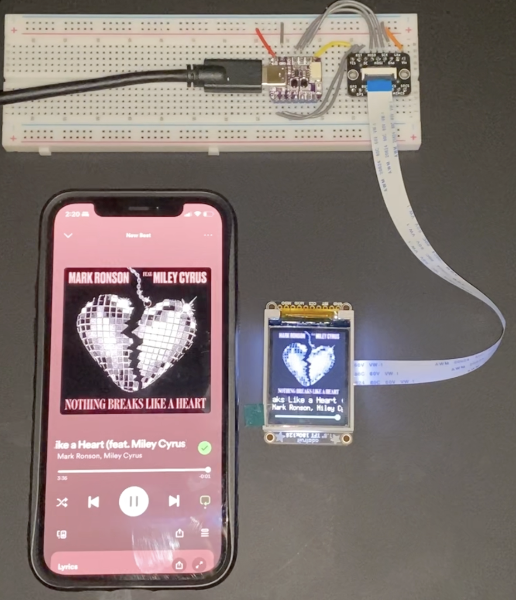

# ESP Display

A small embedded project that shows what I'm listening to on Spotify by using [my Spotify service](https://github.com/tsar-boomba/spotify-me).

## Example

## Notable Features

- ESP32-S3 board
- Written in Rust
- Uses the SPI peripheral to communicate with the screen
- Uses ESP-IDF's HTTP/S client to connect with my server
- Uses ESP-IDF's WPA2Personal and WPA2Enterprise capabilities to obtain an internet connection
- Takes advantage of FreeRTOS's tasks/threads to employ non-blocking updates to UI state

## Parts

- [Adafruit QT Py S3 with 2MB PSRAM](https://www.adafruit.com/product/5700)
  - You can use any ESP, but the PSRAM is used in this application for decoding the album image, so it is heavily reccommended. The second core is also useful for unblocking the main thread for UI.
- [1.8" Color TFT LCD ST7735R](https://www.adafruit.com/product/358)
- [EYESPI Breakout Board](https://www.adafruit.com/product/5613)
- [EYESPI Cable](https://www.adafruit.com/product/5240)

## Future Plans

1. Try out on other ESP chips
   - ESP32-C3
   - ESP32-C6
   - ESP32
2. Design and fabricate a custom PCB
3. Design and fabricate a case for the custom PCB

## Development

1. Install the Rust ESP tools following the prerequisites section in [the `esp-idf-template` repository](https://github.com/esp-rs/esp-idf-template#prerequisites).
2. Run `./sim.sh` to run the `embedded-graphics` simulator and quickly test UI changes.
3. Run `cargo run` to flash a connected ESP and run on real hardware.
